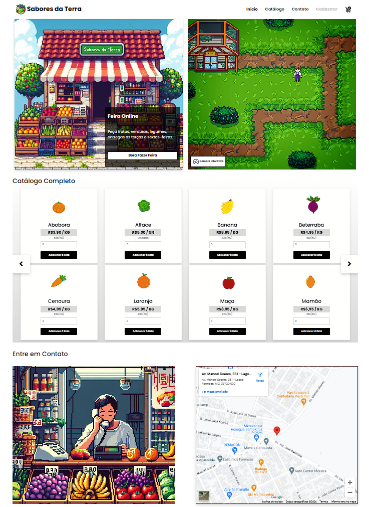
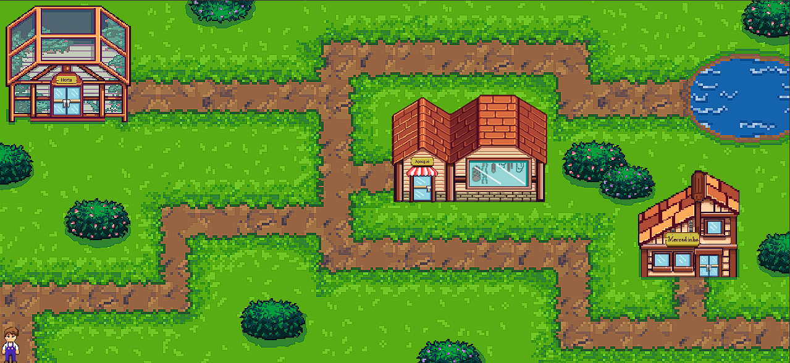
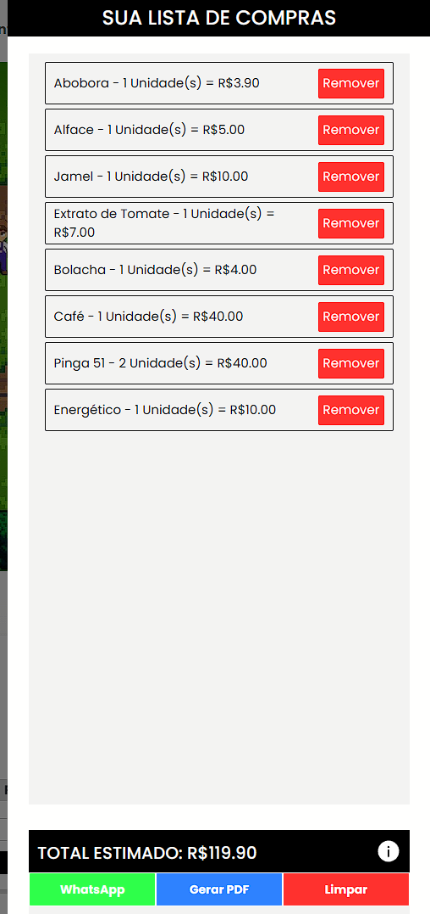

<h1 align="center">
  
</h1>

<h1 align="center">LISTA DE COMPRAS INTERATIVA</h1>

  <a href="#-tecnologias">Tecnologias</a>&nbsp;&nbsp;&nbsp;|&nbsp;&nbsp;&nbsp;
  <a href="#-projeto">Projeto</a>

 

  

## 🚀 Tecnologias

Esse projeto foi desenvolvido com as seguintes tecnologias:

- HTML
- CSS
- JavaScript

## 💻 Projeto

O objetivo principal do projeto foi desenvolver um 
site para a empresa "Sabores da Terra", uma 
frutaria que não possuía nada no meio digital. 
Outro foco do projeto foi o desenvolvimento de 
uma lista interativa, que havia como propósito 
atrair a atenção dos clientes e tornar o site mais 
dinâmico. 

  

 

Com o site, os clientes poderiam ser informados 
sobre promoções e preços sem a necessidade dos 
mesmos saírem de casa, conseguindo fazer sua 
própria lista e já possuírem uma noção de preço, 
proporcionando maior praticidade e menos gasto 
de tempo na realização de suas compras.

  

 

Com o projeto, se torna possível concluir que a 
inclusão da empresa na área digital é 
evidentemente importante, visto que ajuda o cliente 
a possuir mais praticidade ao realizar suas compras 
e também proporciona maior visualização e 
destaque para a empresa, aumentando seu público 
devido às diferentes maneiras de criar sua lista de 
compras e seus anúncios.

PI Primeiro período Sistemas de Informação 1-A. 

